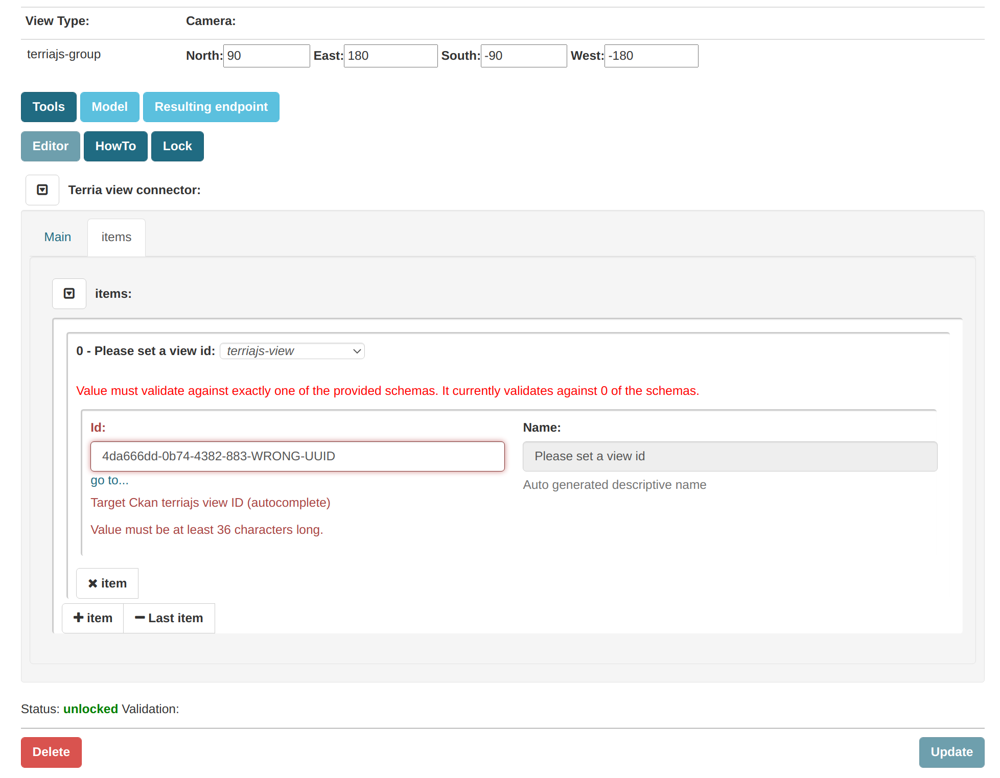
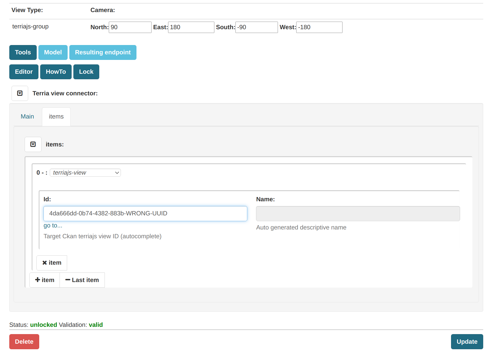
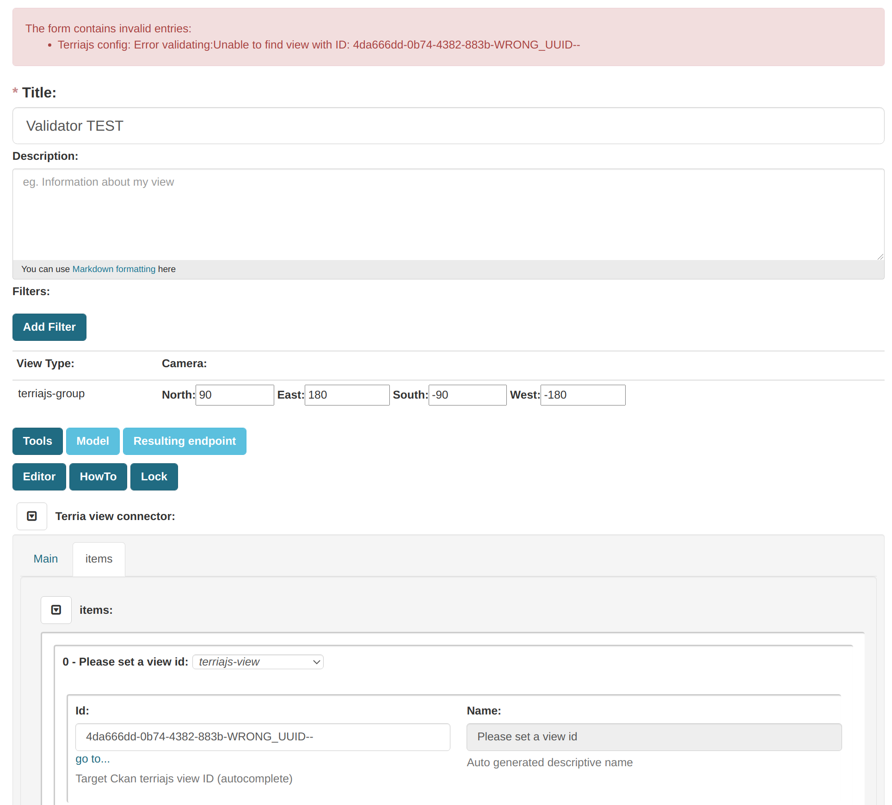
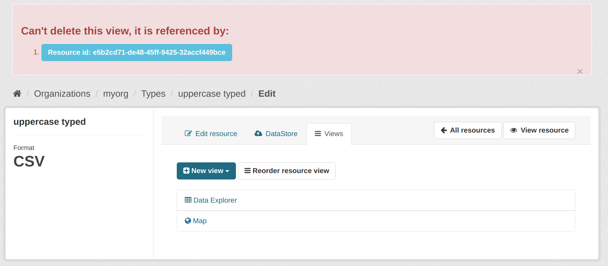
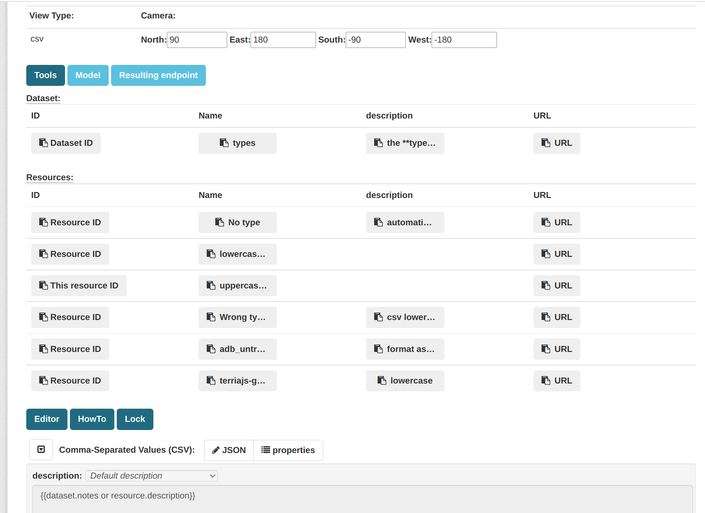

.. contents:: Table of Contents
   :depth: 2

|

Description
===========

.. _plugin

The TerriaJS view plugin provide an extensible and highly configurable set of views ready for TerriaJS.

It leverages over JSON schema to facilitate and speedup the configurations editing for each configured type (csv, wms, wmts, etc).

The plugin also presents an embedded overview of the result showing the layer into an Iframe.

**Image below**: **ckanext-terriajs** loaded iframe on CKAN.

|

.. image:: docs/img/terriajs_load.png
   :class: with-shadow
   :width: 600 px
   :alt: Loaded view

|

The terriajs view plugin can link existing views and group them into virtual (lazy loaded) groups of configurations.

It also allows you to use jinja2 template to fill in informations into terriajs views cherry picking the title, description and more directly from the dataset or the target resource.

The dynamic approach (lazy-load + jinja2) allows you to create views which are always in synch with the changes made over the metadata and the resource to show.

The plugin is also able to automatically create a configurable sets ove views (you define what you want to have automatically and how).

Out of the box it is already capable to automatically create views over wms, mvt, csv formats. 

|

Validation
==========

.. _validation

The plugin is heavily based on a JSON + JSON-SCHEMA approach.

It ships also an ui form generator which is able to drive the user into the creation or modification of a new (or existing) view.

The **frontend** js library used is `json-editor <https://github.com/json-editor/json-editor>`__ but there's also an `ACE editor <https://ace.c9.io/>`__ and `AJV validation <https://ajv.js.org/>`__ to simplify quick editing from experienced editors.

Both UI js libraries are configured to provide UI validation based on JSON schema.

|

|

At the **backend** side the plugin leverages over `jsonschema <https://python-jsonschema.readthedocs.io/en/stable/>`__.
This is the sole python dependency **required to install**.
Thanks to this additional validation the rest API is covered with validation.

|

All the json-schema (draft4) supported by terriajs v7 are provided into a folder in the source tree (tbt).

|

Dynamic models (lazy-loaded)
============================

.. _lazy_models

The terriajs view plugin defines a _special_ type which is resolved at request time so you can easily keep connected existing views into dynamic groups by view id.

The special resource type 'terriajs-group' infact is binded (configurable) to a schema which allows you to search (using ui) and connect existing terriajs views (csv, mvt, etc)

With this approach an administrator is able to create dynamic collections which will be _resolved_ at each request, giving you a fresh copy shipping all the changes performed by editors to each connected view (the views can also be dynamically resolved thanks to jinja2 templating approach)

|

Reference Integrity
===================

.. _reference integrity

Having a lazy load root node 'terriajs-group' adds the challenge to keep reference integrity (1-to-many) from the terriajs-group to the target childrens (existing views).

The terriajs view plugin forbids the deletion of existing referenced views so a terriajs-group will always be consistent.

|

Note
----

This plugin leverages over postgres + json approach **NOT STORING OR CREATING ANY ADDITIONAL TABLE**, I consider this a plus for any migration (at the cost of a bit of complexity in terms of query and reference integrity).

Reference integrity will check (on the backend) if the id of the target view (resolved dynamically) is not existent 

|

Trying to send a not valid id
-----------------------------

|

|

Reporting the error to the editor
---------------------------------

|

|

Referenced View deletion
------------------------

The plugin warns the owner of the view providing the list (hrefs) of existing 'terriajs-group' pointing to his view.

|

|

Tools
=====

.. _tools

The UI is also providing a quite extensive set of buttons (copy to clipboard) to easily customize (in case of need) the view with static details.

It also provides a set of buttons to test the resulting API endpoints (which will be used to connect an existing terriajs installation)

|

|

API
===

.. _api

In addition to the cksn standard action (create_view, etc)

|

The plugin also provide a new set of blueprint endpoints:

|

    /terriajs/describe

describe an existing view by id, used by terriajs-group

|

    /terriajs/search

search an existing view by resource or dataset title/description, used by terriajs-group)

|

    /terriajs/schema/<filename>

 a proxy to resolve relative schema references (ckan can work also as source of schemas in case you don't have a static repository)

|

    /terriajs/config/[<enabled|disabled>/]<uuid>.json

an endpoint to return a valid and dinamically resolved and interpolated full terriajs configuration (used by the **preview**).

You can set **enabled** to have all the items (recursively) enabled and displayed over the map or **disabled** to force disabling.

|

    /terriajs/item/[<enabled|disabled>/]<uuid>.json

While */config/* returns a fully functional configuration catalog, this endpoint to return the configured (unwrapped) **item** (dinamically resolved and interpolated)

You can set **enabled** to have all the items (recursively) enabled and displayed over the map or **disabled** to force disabling.

|

Extensions
==========

The full lost of terriajs plugin configuation parameters are documented under `constants.py <https://bitbucket.org/cioapps/ckanext-terriajs/src/master/ckanext/terriajs/constants.py>`__

The terriajs configuration item type is defined into the configuration with a target json-schema.

The configuration is shippend in a file called `type-mapping.json <https://bitbucket.org/cioapps/ckanext-terriajs/src/master/type-mapping.json>`__ which is a serialized dict (a map):

    {
        'terria-js-type': 'URI'
    }

**terria-js-type** is the terriajs item type ref `here <https://docs.terria.io/guide/connecting-to-data/catalog-items/>`__ for a complete list.

**URI** can be:
  
  - relative to the PATH_SCHEMA folder (see constants.py)

  - http link to a target json schema

On startup the plugin check the list to understand which item is supported and add that format to the list.

When you add a resource to a dataset the **type** is mapped over type-mapping configuration and the matching json-schema is loaded to provide validation (frontend and backend side)

Based on the selected schema a different UI will be automatically provided and validated thanks to json-editor.

The json-schma will define all the required fields and the minimum requirements to have a good and valid json (frontend interactive validation/creation).

|

Requirements
============

Before installing ckanext-terriajs, make sure that you have installed the following:

* CKAN 2.8 and above
* terriajs 7

|

Installation
============

We are not providing pip package to install please use:

    git clone https://bitbucket.org/cioapps/ckanext-terriajs.git
    cd ckanext-terriajs
    python setup.py install

|

Configuration
=============

Please ref to constants.py for a full updated list

    ckanext.terriajs.default.name=TerriaJS Map
    ckanext.terriajs.always_available=True
    ckanext.terriajs.default.title=TerriaJS view
    ckanext.terriajs.icon=globe
    ckanext.terriajs.url=http://localhost:8080
    ckanext.terriajs.default.formats=['csv','mvt']

|

Development
===========

To install ckanext-terriajs for development, activate your CKAN virtualenv and do::

    git clone https://bitbucket.org/cioapps/ckanext-terriajs.git
    cd ckanext-terriajs
    python setup.py develop
    
|

Tests
=====

To run the tests:

1. Activate your CKAN virtual environment, for example::

     . /usr/lib/ckan/default/bin/activate

2. From the CKAN root directory (not the extension root) do::

    pytest --ckan-ini=test.ini ckanext/terriajs/tests

