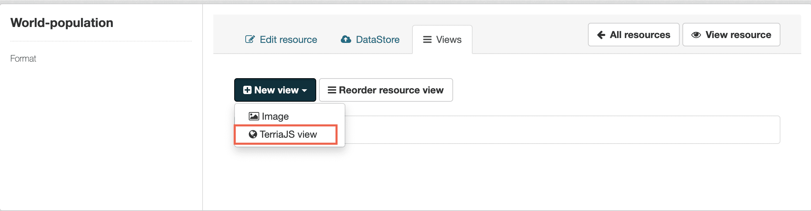
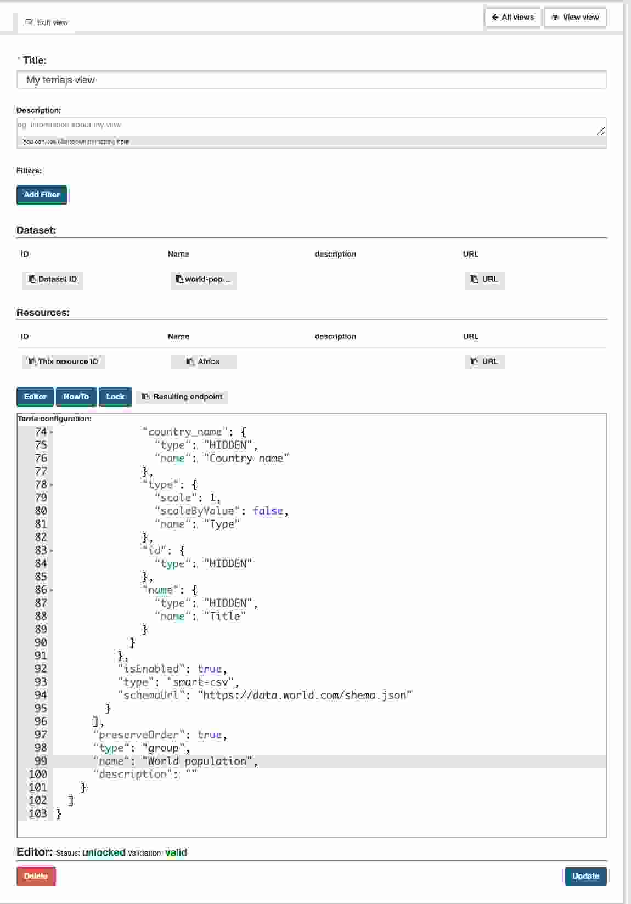
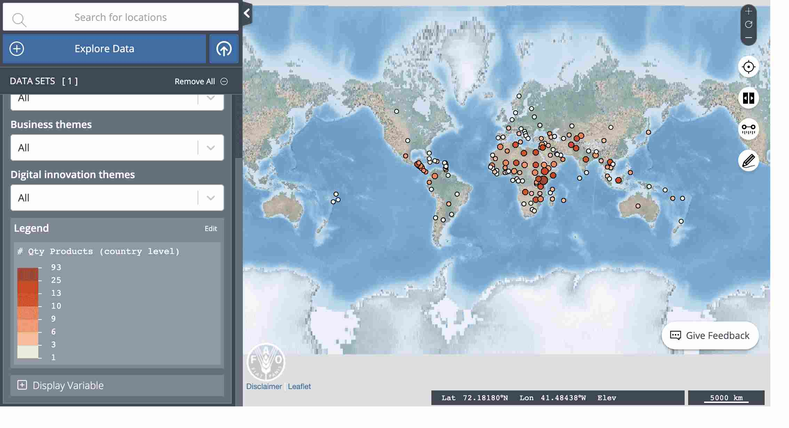

ckanext-terriajs
=====================================

|
|

**ckanext-terriajs** provides the TerriaJS configuration that implements JSON schema validations and facilitates information from the metadata and resources.

The plugin also presents an embedded overview of the result showing the layer into an Iframe.

|
|

**ckanext-terriajs** Adds a view to the resource and that will enable the creation of **ckanext-terriajs** views on the resource.
**Image below**: Creating a **ckanext-terriajs** view.

|

|

**Image below**: Configuring the plugin.

|

|

**Image below**: **ckanext-terriajs** view on CKAN.
|

|

Requirements
------------

Before installing ckanext-terriajs, make sure that you have installed the following:

* CKAN 2.8 and above

Installation
------------

To install ckanext-terriajs:

1. Activate your CKAN virtual environment, for example::

     . /usr/lib/ckan/default/bin/activate

2. Install the ckanext-terriajs Python package into your virtual environment::

     pip install ckanext-terriajs

3. Add ``terriajs`` to the ``ckan.plugins`` setting in your CKAN
   config file (by default the config file is located at
   ``/etc/ckan/default/production.ini``).

4. Add ``terriajs`` to the ``ckan.views.default_views`` setting in your CKAN
   config file (by default the config file is located at
   ``/etc/ckan/default/production.ini``).

4. Restart CKAN. For example if you've deployed CKAN with Apache on Ubuntu::

     sudo service apache2 reload

Configuration
-------------

You must make sure that the following is set in your CKAN config::

    ckanext.terriajs.default.name=TerriaJS
    ckanext.terriajs.always_available=True
    ckanext.terriajs.default.title=TerriaJS view
    ckanext.terriajs.icon=globe
    ckanext.terriajs.url=http://localhost:8080

Development
-----------
To install ckanext-terriajs for development, activate your CKAN virtualenv and do::

    git clone https://bitbucket.org/cioapps/ckanext-terriajs.git
    cd ckanext-terriajs
    python setup.py develop
    

Tests
-----
To run the tests:

1. Activate your CKAN virtual environment, for example::

     . /usr/lib/ckan/default/bin/activate

2. From the CKAN root directory (not the extension root) do::

    pytest --ckan-ini=test.ini ckanext/terriajs/tests

