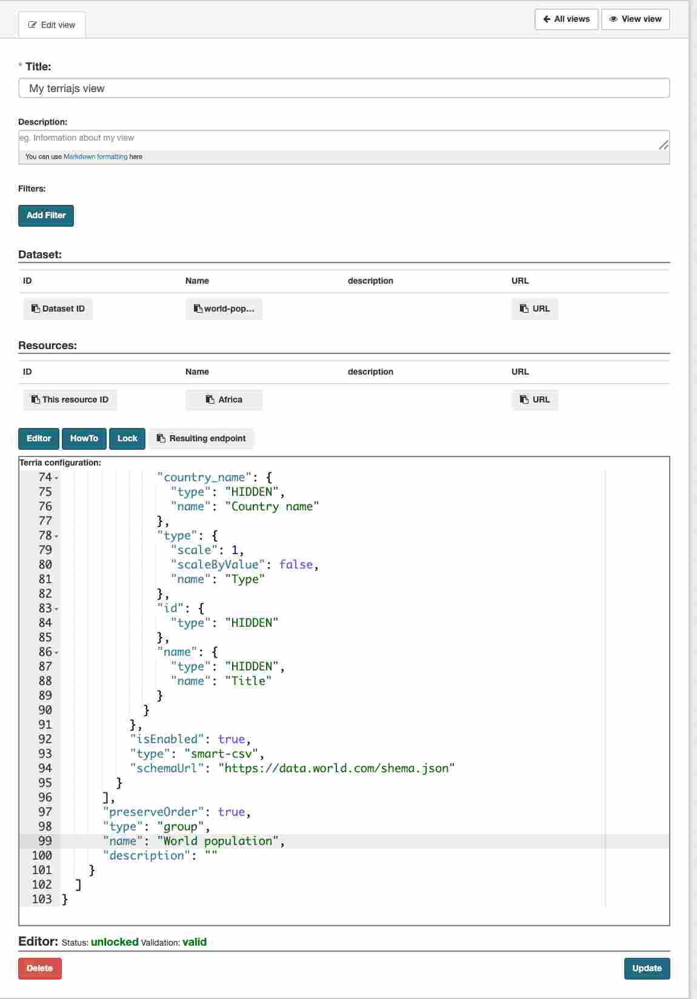

ckanext-terriajs
=====================================

|

It provides the TerriaJS configuration editor that leverages over JSON schema validation and facilities to grab informations from the metadata and resources.

The plugin also presents an embedded overview of the result showing the layer into an Iframe and a set of API to fetch the created configuration.

|

**ckanext-terriajs** Adds a view to the resource and that will enable the creation of **ckanext-terriajs** views on the resource.

**Image below**: Creating a **ckanext-terriajs** view.

|

.. image:: docs/img/creating_terriajs_view.png
    :alt: Creating a ckanext-terriajs view

|

**Image below**: You can set the **name**, **description** and the **terriajs JSON configuration**.
**ckanext-terriajs**

|

|

**Image below**: **ckanext-terriajs** loaded iframe on CKAN.
|

.. image:: docs/img/terriajs_load.png
    :alt: Loaded view

|
|

Requirements
------------

Before installing ckanext-terriajs, make sure that you have installed the following:

* CKAN 2.8 and above

|
|

Installation
------------

We are not providing pip package to install please use:

    git clone https://bitbucket.org/cioapps/ckanext-terriajs.git
    cd ckanext-terriajs
    python setup.py install

|
|

Configuration
-------------

You must make sure that the following is set in your CKAN config::

    ckanext.terriajs.default.name=TerriaJS
    ckanext.terriajs.always_available=True
    ckanext.terriajs.default.title=TerriaJS view
    ckanext.terriajs.icon=globe
    ckanext.terriajs.url=http://localhost:8080

|
|

Development
-----------
To install ckanext-terriajs for development, activate your CKAN virtualenv and do::

    git clone https://bitbucket.org/cioapps/ckanext-terriajs.git
    cd ckanext-terriajs
    python setup.py develop
    
|
|

Tests
-----
To run the tests:

1. Activate your CKAN virtual environment, for example::

     . /usr/lib/ckan/default/bin/activate

2. From the CKAN root directory (not the extension root) do::

    pytest --ckan-ini=test.ini ckanext/terriajs/tests

